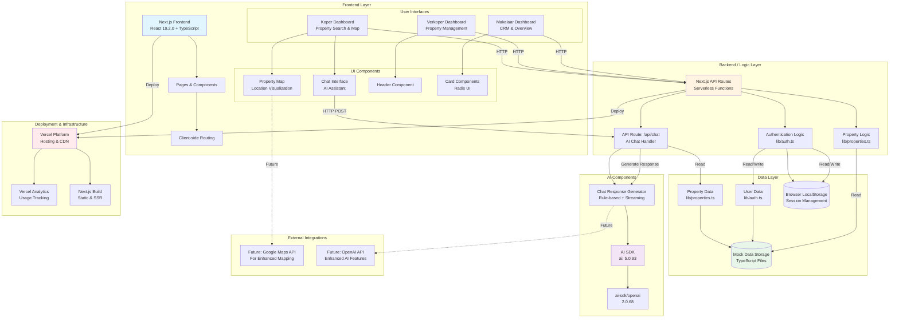

# Software Architecture Diagram - Vastgoedplatform

## Overzicht

Dit document beschrijft de software architectuur van het Vastgoedplatform. Het platform is gebouwd met Next.js en biedt functionaliteit voor drie typen gebruikers: makelaars, verkopers en kopers.

## Architectuur Diagram



## Gedetailleerde Component Beschrijving

### 1. Front-end Layer

#### Technologieën
- **Next.js 16.0.3**: React framework met server-side rendering
- **React 19.2.0**: UI library
- **TypeScript**: Type-safe development
- **Tailwind CSS 4.1.9**: Utility-first CSS framework
- **Radix UI**: Accessible component primitives

#### Hoofdcomponenten

**User Interfaces:**
- **Koper Dashboard** (`/app/koper/`)
  - Property overzicht met zoek- en filterfunctionaliteit
  - Interactieve kaartweergave (`/app/koper/map/`)
  - Property detailpagina's met AI chat

- **Verkoper Dashboard** (`/app/verkoper/`)
  - Beheer van eigen properties
  - Status tracking en updates

- **Makelaar Dashboard** (`/app/makelaar/`)
  - CRM overzicht
  - Property management voor meerdere verkopers
  - Bezoek- en biedingenoverzicht

**Reusable Components:**
- `ChatInterface`: AI-powered chat component voor property vragen
- `PropertyMap`: Custom map component voor property locaties
- `Header`: Navigatie component
- UI componenten: Button, Card, Input, Badge, etc.

### 2. Back-end / Logic Layer

#### Next.js API Routes

**`/api/chat` (route.ts)**
- Handles POST requests voor chat interacties
- Verwerkt property-specifieke vragen
- Genereert streaming responses
- Integreert met property data

**Business Logic Modules:**
- `lib/auth.ts`: Authenticatie en gebruikersbeheer
  - Mock user data
  - Login/logout functionaliteit
  - Role-based access control

- `lib/properties.ts`: Property data management
  - Property interfaces en types
  - Mock property data
  - Helper functies (getPropertyById, calculateDistance)
  - Coordinate mapping

### 3. Database Layer

**Huidige Implementatie:**
- Mock data in TypeScript files
- In-memory data storage
- LocalStorage voor sessie management

**Data Entiteiten:**

**Property Entity:**
```typescript
- id, address, city, postalCode
- price, type, rooms, bedrooms
- area, plotSize, buildYear
- energyLabel, status, description
- features[], images[]
- sellerId, views, visits[], bids[]
- interested, phase
- neighborhood: {
    schools[], sports[], transport[], events[]
}
```

**User Entity:**
```typescript
- id, name, email
- role: 'makelaar' | 'verkoper' | 'koper'
- propertyId (voor verkopers)
```

**Visit Entity:**
```typescript
- id, date, buyerId, buyerName
- feedback, rating
```

**Bid Entity:**
```typescript
- id, amount, buyerId, buyerName
- date, status, comments
```

**Toekomstige Database:**
- Aanbevolen: PostgreSQL of MongoDB
- ORM: Prisma of Mongoose
- Migratiepad beschikbaar

### 4. AI Componenten

#### Huidige Implementatie

**AI SDK Packages:**
- `ai: 5.0.93`: Core AI SDK voor streaming responses
- `@ai-sdk/openai: 2.0.68`: OpenAI integratie (voorbereid)

**Chat Functionaliteit:**
- Rule-based response generator
- Property-specifieke vraag beantwoording
- Streaming response simulatie
- Context-aware antwoorden over:
  - Property details (prijs, grootte, kamers)
  - Buurtinformatie (scholen, transport, sport)
  - Status en biedingen

**Toekomstige Uitbreidingen:**
- OpenAI GPT integratie voor natuurlijkere conversaties
- LangChain voor geavanceerde AI workflows
- Vector database voor property context

### 5. Deployment & Integraties

#### Vercel Platform
- **Hosting**: Serverless functions en static assets
- **CDN**: Global content delivery
- **Analytics**: Gebruiksstatistieken via Vercel Analytics
- **CI/CD**: Automatische deployments vanuit GitHub

#### Build Process
- Next.js build genereert:
  - Static pages (SSG)
  - Server components (SSR)
  - API routes (serverless functions)

#### Monitoring & Analytics
- Vercel Analytics ingebouwd
- Real-time performance monitoring
- Error tracking mogelijk

## Data Flow

### Chat Flow
```
User Input → ChatInterface Component
  ↓
POST /api/chat (with propertyId)
  ↓
Chat API Route
  ↓
Fetch Property Data (lib/properties.ts)
  ↓
Generate Response (Rule-based or AI)
  ↓
Stream Response back to Client
  ↓
Update UI with streaming chunks
```

### Authentication Flow
```
User Login → Login Page
  ↓
Validate Email (lib/auth.ts)
  ↓
Store User in LocalStorage
  ↓
Route to Role-based Dashboard
  ↓
Load Dashboard with User Context
```

### Property Search Flow
```
User Search → Koper Dashboard
  ↓
Filter Properties (lib/properties.ts)
  ↓
Calculate Distances
  ↓
Sort by Distance
  ↓
Display on Map & List
```

## Security Considerations

### Huidige Implementatie
- Client-side authentication (mock)
- LocalStorage voor sessie
- No backend validation

### Aanbevolen Verbeteringen
- JWT tokens voor authenticatie
- Server-side session management
- API rate limiting
- Input validation en sanitization
- HTTPS enforcement

## Performance Optimisaties

1. **Next.js Optimizations:**
   - Automatic code splitting
   - Image optimization (configured)
   - Static generation waar mogelijk

2. **Client-side:**
   - React state management
   - Lazy loading components
   - Debounced search inputs

3. **Future Optimizations:**
   - Database indexing
   - Caching strategy
   - CDN voor static assets

## Scalability Considerations

### Huidige Limitaties
- In-memory data (niet schaalbaar)
- Single serverless function
- No database connection pooling

### Schaalbaarheidsstrategie
- Database migratie naar cloud service
- API rate limiting en caching
- Microservices architectuur (indien nodig)
- Load balancing via Vercel

## Technologie Stack Overzicht

| Layer | Technologie | Versie |
|-------|------------|--------|
| Framework | Next.js | 16.0.3 |
| UI Library | React | 19.2.0 |
| Language | TypeScript | ^5 |
| Styling | Tailwind CSS | 4.1.9 |
| Components | Radix UI | Various |
| AI SDK | AI SDK | 5.0.93 |
| AI Provider | @ai-sdk/openai | 2.0.68 |
| Analytics | Vercel Analytics | latest |
| Deployment | Vercel | Platform |

## Conclusie

Het Vastgoedplatform gebruikt een moderne, serverless architectuur gebouwd op Next.js. De applicatie is gestructureerd voor groei en kan gemakkelijk worden uitgebreid met een echte database en geavanceerde AI features. De huidige mock data implementatie kan naadloos worden vervangen door een productiedatabase.

